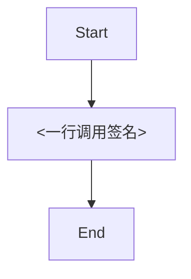

# 递归原理 · 编码与协作公约

## §0 四大基石与递归种子（全文唯一公理）

### 0.1 四大基石（接到任务前必须默念）

- **思维**：使用第一性思维，不要把简单问题复杂化。
- **理念**：任何复杂系统 = 简单原子 + 调用拼装 —— 此为递归种子（§0.2 展开）。
- **约定**：每个任务必须先**彻底锁定用户的真实意图与最终目的**，再制定方案，再实施编码。
- **沟通**：用简单易懂的描述 + 图表 / ASCII 逻辑流程图对比与用户沟通；沟通阶段是**逻辑层**，**不展示代码**（避免混乱、臃肿）。
- **整洁**：目录结构要清晰,比如测试框架需要当成项目一样维护,必须标准规范.不要创建任何垃圾文件.如果必须创建临时文件,则使用后必须删除。 

### 0.2 递归种子（理念展开，全文唯一公理）

> **任何复杂系统 = 简单原子 + 调用拼装。**
> 同一套法则**递归套到每一层**：项目 → 模块 → 类 → 函数 → 行 → 文档。

```
公理：原子 + 组合 + 调用
   ├─ 套到「项目」 = 模块的组合
   ├─ 套到「模块」 = 类 / 函数的组合
   ├─ 套到「类」   = 方法的组合（主类只声明 + 转发，不藏逻辑）
   ├─ 套到「函数」 = 一行调用的有序组合
   └─ 套到「文档」 = 任务档案 + 业务条目 + 复用条目 + 参考条目
                    （每个条目内部也是 定位 + 调用 + 流程 三段，与代码层同构）
```

**全文阅读顺序**：§0 公理 → §1 原子 → §2 组合 → §3 调用 → §4 动作 → §5 红线 → §6 文档 → §7 自检。
每一节都是公理在一个层级上的展开。

**适用边界**：本公约全套（§1–§7）适用于「业务模块 / 复用单元的新增与重构」。
临时脚本 / 一次性 SQL / 紧急 hotfix 可降级为「§5 红线 + §7 自检」即过。

---

## §1 原子层 —— 最小单元定义

> 公理在此层 = **每个最小单元都能从外部用「一行调用」触发**。

### 1.1 一行调用（核心术语，全文复用）

**定义**：调用方写**一行**即可完成核心动作；参数组装、错误处理、状态管理、内部分散结构**全部内聚到被调侧**。

```python
result = parse_frontmatter(text)              # ✅ 原子函数 · 一行调用
user   = UserService(db).login(payload)       # ✅ 类组合 · 链式仍算一行
<SpecCard data={record} onConfirm={ok} />     # ✅ 前端组件 · 一行调用
```

### 1.2 原子的判据（什么时候"够小"）

- ✅ 一句话能完整概括其全部职责 → 是原子
- 🔁 函数 / 类行数 > 200 且能压到 50 → 必须重写为更小的原子
- 🚫 一次性使用（single-use）的代码 → **禁止抽象**为原子（重复 3 次再抽）

### 1.3 原子的边界

- **入口**：唯一参数表（args）
- **出口**：唯一返回值（returns）
- **禁止**：通过全局变量 / 隐式状态 / 副作用与外界通信

---

## §2 组合层 —— 原子怎么拼

> 公理在此层 = **复杂功能 = 原子的有序组合**；组合方式只有两种：函数链 / 类拆分。

### 2.1 简单通用功能 → 函数组合（一行调用嵌套）

```python
result = func_c(func_b(func_a(input)))        # 三个原子函数组合 = 复合功能
```

### 2.2 复杂功能 → 类组合（主类只声明 + 转发，原子放 `_<功能域>.py`）

```python
# user_service.py — 主类：方法声明 + 转发（调用层视角，不藏业务逻辑）
class UserService:
    def login(self, payload):
        return _user_auth.login(self, payload)     # 转发到鉴权原子文件
    def test(self, aa):
        return _user_text.test(self, aa)           # 转发到文本原子文件


# _user_auth.py — 鉴权原子（原子层视角）
def login(self, payload):
    ...


# _user_text.py — 文本原子（原子层视角）
def test(self, aa):
    ...
```

**递归映射**（公理在类内部的复现）：

| 类内角色 | 对应公理层 | 职责 |
|:--|:--|:--|
| 主类文件 `user_service.py` | **调用层** | 暴露黑盒，调用方一行 `UserService(db).login(payload)` |
| 分类文件 `_user_auth.py` 等 | **原子层** | 真实实现，按功能域命名（auth / text / billing …） |
| 主类内的转发方法 | **组合层** | 把外部调用路由到对应原子 |

**何时拆**：类 > 200 行且能压到 50 行就拆；50 行以内的类不需要拆。

---

## §3 调用层 —— 黑盒契约

> 公理在此层 = **调用方永远只写一行；模块间只通过 args / returns 通信**。

| 维度 | 通过判据 |
|:--|:--|
| 🚀 黑盒 | 调用方只需 **1 行**即可完成核心调用 |
| 🔗 解耦 | 模块间通信**严格且唯一**通过入参 / 返回值；禁全局变量、禁隐式状态 |
| 🧩 单一 | 被调侧能用**一句话**概括其全部职责 |

---

## §4 递归动作路径 —— 任务工作流 SOP（3 阶段 × 9 步）

> 公理在此层 = **同一套 SOP 递归套到任意粒度的任务**（改一行 / 写一个函数 / 建一个模块都走同一套）。
>
> **核心纪律**：
> - 先穷举信息 ▸ 再问用户
> - 先建档立项 ▸ 再动手改代码
> - 读源码事实 ▸ 不凭记忆推断
> - 一行调用 ▸ 不多步散写

```
[阶段一：侦测与锁定]
    ▼
[1] 信息穷举：把「用户目的 / 预期 / 效果」三问的答案从下列信息源挖出来
    ├─ ./.pp/wiki/ （当前任务 / 任务归档 / 前端 / 后端 / 复用 / 参考）
    ├─ 当前代码 （事实，不靠记忆）
    ├─ MCP 工具 / Memory / CLAUDE.md / 对话历史
    └─ 全部查完仍有歧义 → §5.5 禁默选 → 列候选 + 询问用户
    ▼
[2] 现状摸底：基于真实源码事实画 Mermaid 逻辑流程图（节点 = 一行调用签名；禁凭记忆推断）
    ▼
[3] 意图锁定：明确说出"用户究竟想要什么结果"

[阶段二：立项与设计]
    ▼
[4] 创建任务档案：在 `./.pp/wiki/当前任务/<任务名>/` 下建立 3 个标准核对文件
    ├─ 01_意图与目的.json ：「用户原始描述」+「澄清后锁定的真实目的」
    ├─ 02_执行方案.json   ：「Mermaid 逻辑流程图」+「数据源说明」+「具体执行细节」
    └─ 03_测试验收.json   ：明确验收标准与用例；必须基于**真实无 UI 框架**
                          （含前端全部功能的底层核心，无图形界面但模拟真实用户操作序列）；
                          严禁浅层 Mock 敷衍
    ▼
[5] 双源核对：与历史决策 / 已落文档对照；冲突时取「最新明确决策」
    ▼
[6] 向用户交底：提交《任务方案》（含意图 + 流程图 + 验收方式）让用户确认
    │         └─ 未确认 → 绝对不动手；即使用户说「帮我优化」也要先列细节确认

[阶段三：执行与验收收尾]
    ▼
[7] 编码执行：严格手术刀原则（§5.6），落实《02_执行方案》
    ▼
[8] 跑通验收：按《03_测试验收》的无 UI 框架模拟真实用户操作跑通闭环；
              逐一核对 §7 自检 5 项；全过才允许提交
    ▼
[9] 任务归档：交付完成且无误后，将整个 `./.pp/wiki/当前任务/<任务名>/` 目录
              **整体迁移**至 `./.pp/wiki/任务归档/<任务名_完成日期>/`，
              确保当前任务区清空，历史记录可溯源
```

**9 步与 4 个 pp-* 工作流的映射**：

| 阶段 | SOP 步骤 | 对应工作流 | Skill |
|:--|:--|:--|:--|
| 前置（一次性） | — | wiki 骨架初始化 + 项目分析 | `/pp-init` |
| 阶段一 | [1] [2] [3] | 澄清 | `/pp-clarify` |
| 阶段二 | [4] [5] [6] | 方案制定（含根因定位） | `/pp-plan` |
| 阶段三 | [7] [8] [9] | 执行验收循环 + 归档 | `/pp-execute` |

---

## §5 递归红线（套到任何层级都成立）

| # | 红线 | 含义 |
|:--|:--|:--|
| 5.1 | 🚫 **禁逃避式修复** | 不许用「向下兼容 / 逻辑回退 / 功能最小化 / 设置兜底（Fallback）」绕开根本问题 |
| 5.2 | 🚫 **禁打补丁** | 不合理的底层设计 → **打破并彻底重构**；禁在错误基石上无限叠补丁 |
| 5.3 | 🚫 **错误逻辑必须推翻** | 从根源解决，不在下游掩盖报错 |
| 5.4 | 🎯 **用户目的 = 硬标准** | 不确定可澄清；锁定真实目的后**禁止偏离** |
| 5.5 | 📋 **禁默选 · 禁沉默选边** | 多解读 → 必须**列所有候选**；不确定 → 必须明说"不确定什么"，禁"我以为""应该是" |
| 5.6 | 🔪 **手术刀原则** | 只动直接为当前目的服务的代码；禁顺手改邻接代码 / 注释 / 格式；禁重构没坏的东西；匹配既有风格；发现 dead code → **提示用户，不擅自删** |

每一条红线在「函数层 / 类层 / 模块层 / 项目层」**同等成立**，无层级豁免。

---

## §6 文档层（./.pp/wiki/）—— 文档也是递归

> 公理在此层 = **`./.pp/wiki/` 结构与代码结构同构**。
> 任务档案 = 当前正在做的事；业务条目 = 主类文件（调用层视角）；复用条目 = `_<功能域>.py`（原子层视角）；参考条目 = 外部依赖声明。

### 6.1 物理路径（🔒 固定）

> **路径约束**：始终以「项目根」为基准路径，
> 即 `<project_root>/.pp/wiki/`，文中写作 `./.pp/wiki/`。
> 任何子目录里的工具 / 脚本 / 文档互引 都应推算回项目根路径，
> 禁止以「当前工作目录」为基准。

```
./.pp/wiki/
├─ 当前任务/                    ← 🟢 进行中的任务工作区（可并存多个；executing 状态全局唯一）
│   └─ <任务名>/
│       ├─ 01_意图与目的.json       ← 【必填】原始描述 + 锁定后的真实目的
│       ├─ 02_执行方案.json         ← 【必填】Mermaid 流程图 + 数据源 + 执行细节
│       └─ 03_测试验收.json         ← 【必填】真实无 UI 框架验收用例与预期
│
├─ 任务归档/                     ← 🟢 已完成任务沉淀（验收通过后整体迁入）
│   └─ <任务名_完成日期>/
│
├─ 前端/                         ← 业务条目（调用层视角）
│   ├─ <业务名 A>.md
│   └─ <用户中心>/
│       ├─ index.md
│       ├─ <个人资料>.md
│       └─ <screenshot>.png
│
├─ 后端/                         ← 业务条目（调用层视角）
│   ├─ <业务名 C>.md
│   └─ <项目编排>/
│       └─ index.md
│
├─ 复用/                         ← 原子条目（原子层视角，4 类固定子目录）
│   ├─ 函数库/{函数名}.md
│   ├─ 类库/{类名}.md
│   ├─ 前端组件库/{组件名}.md
│   └─ 数据标准/{标准名}.md
│
└─ 参考/                         ← 外部依赖（web 资料 / 官方文档）
    ├─ <主题名 A>.md
    └─ <主题名 B>/
        ├─ README.md
        ├─ <原始 web 文件>
        └─ <子主题>.md
```

**约束**：
- 🔒 一级目录 **6 个固定**（当前任务 / 任务归档 / 前端 / 后端 / 复用 / 参考）
- 🔒 复用层 4 个子目录固定；**这 4 个子目录内部不再嵌套子目录**，直接放 `.md`
- 📝 业务 / 参考条目：简单 → 单文件 `.md`；复杂（≥2 子模块 / 含附件 / >300 行）→ 同名目录 + `index.md` 或 `README.md`
- 🟢 任务档案：3 个文件**必填**；全过 §7 自检后才能从 `当前任务/` 整体迁入 `任务归档/`

### 6.2 任务档案骨架（当前任务 / 任务归档）

每个任务在 `./.pp/wiki/当前任务/<任务名>/` 下必须包含且**仅包含**以下 3 个文件：

> **实际落盘格式**：自 2026-05-18 起，3 个任务档案改为 `.json`；以下 markdown 模板仅作**字段含义说明**，完整严格 schema 见对应 skill：
> - `01_意图与目的.json` → `~/.claude/skills/pp-clarify/SKILL.md §6`
> - `02_执行方案.json` → `~/.claude/skills/pp-plan/SKILL.md §4 + §6`
> - `03_测试验收.json` → `~/.claude/skills/pp-execute/SKILL.md §4`

#### 01_意图与目的.json

```markdown
---
brief: <一句话定位本任务>
created_at: <YYYY-MM-DD>
---

# <任务名>

## 用户原始描述
> 原文照抄，禁止改写

## 澄清过程
- 不确定点 / 候选解读 / 用户回答（按 §5.5 禁默选纪律记录）

## 锁定的真实目的
- 一句话：本任务交付后，用户能做到什么 / 不再受什么困扰
```

#### 02_执行方案.json

````markdown
---
brief: <方案一句话>
---

# 执行方案

## 现状逻辑流程图（Mermaid，基于源码事实）


## 目标逻辑流程图（Mermaid，方案落地后）


## 数据源说明
- 数据从哪来 / 经哪些原子 / 落到哪去

## 执行细节
- 改动点 1：文件:行 + 改动摘要 + 验收命令
- 改动点 2：...
````

#### 03_测试验收.json

```markdown
---
brief: <验收一句话>
---

# 测试验收

## 验收标准
- 标准 1：xxx
- 标准 2：xxx

## 真实无 UI 框架验收用例
> 必须模拟真实用户操作序列，调用前端全部功能的底层核心；**严禁浅层 Mock 敷衍**。

| 用例 | 操作序列 | 预期结果 | 实际结果 |
|:--|:--|:--|:--|
| C1 | ... | ... | ... |
| C2 | ... | ... | ... |
```

**归档流程**：§7 自检全过 → 把整个 `./.pp/wiki/当前任务/<任务名>/` 目录**整体迁移**至 `./.pp/wiki/任务归档/<任务名_完成日期>/`；当前任务区清空。

### 6.3 业务条目骨架（前端 / 后端，单文件与目录通用）

```markdown
---
brief: <一句话定位 + 对应代码路径>
tags: [<可选标签>]
logic_flow: |
  flowchart TD
    Start --> A["<一行调用签名 → 指向 ./.pp/wiki/复用/ 下某文档>"]
    A --> End
---

# <业务名>
## 一句话定位
## 关联代码路径
- <文件路径 1>
- <文件路径 2>
## 流程节点说明
- `<一行调用签名>`：见 `./.pp/wiki/复用/.../xxx.md`
```

**何时升级为目录**（任一即升级）：
- 业务有 ≥2 个**独立子模块**（如「用户中心」含「个人资料 / 设置 / 头像上传」）
- 需要附带**非 markdown 文件**（截图 / 图表 / 示例数据）
- 业务文档 > 300 行

### 6.4 复用条目骨架（4 类统一格式）

| 区块 | 函数库 | 类库 | 前端组件库 | 数据标准 |
|:--|:--|:--|:--|:--|
| 一句话定位 | 干嘛的 | 代表什么 | 呈现什么 | 描述什么数据 |
| 一行调用示例 | `result = fn(a, b)` | `obj = Cls(...).method(...)` | `<Comp prop={...} />` | （引用方式） |
| 入参契约 | 参数表 | 构造参数表 | Props 表 | 字段表 |
| 返回 / 产出 | 返回值表 | 关键方法表 | 渲染输出 | （字段表自身） |
| 流程图 | Mermaid（节点 = 一行调用） | 同左 | 同左（含状态变迁） | 可选 |
| 介绍 | 用法 / 边界 / 陷阱 | 职责 / 边界 / 陷阱 | 使用场景 / 主题契约 | 来源 / 消费者 / 约束 |

### 6.5 参考条目骨架

**简单参考**（`./.pp/wiki/参考/<主题名>.md`，纯说明型）：

```markdown
---
source_url: <原始 URL>
fetched_at: <YYYY-MM-DD>
license: <版权 / 许可>
brief: <一句话定位 + 解决什么问题>
tags: [<可选>]
---

# <主题名>
## 来源
- URL / 抓取时间
## 核心内容
## 项目里依赖这份资料的位置
- <文件路径>:<行号> — 用了 X
```

**大功能参考**（`./.pp/wiki/参考/<主题名>/README.md` + 原始 web 文件保留原名 + 子主题 `.md`）：

```markdown
---
source_url: <原始 URL>
fetched_at: <YYYY-MM-DD>
license: <版权 / 许可>
brief: <一句话定位 + 解决什么问题>
---

# <主题名>
## 来源
- URL / 抓取时间 / 版本（如 React 18 / Claude CLI 1.0.x）
## 本目录内容清单
- `<原始文件 1>`：是什么 / 怎么用
- `<子主题>.md`：本主题下某细分点的展开
## 项目里依赖这份资料的位置
- <文件路径>:<行号> — 用了 X
```

### 6.6 流程图节点纪律（递归映射的强制实现）

节点 = **一行调用签名**（指向 `./.pp/wiki/复用/` 下某文档），**不是动词描述**。

```
✅  result = parse_frontmatter(text)
❌  "解析数据"

✅  <SpecCard data={record} onConfirm={handleOk} />
❌  "渲染卡片"
```

→ 函数库 / 类库 / 前端组件库 的流程图节点**互相引用** → 形成 `./.pp/wiki/复用/` 内部的调用图。
→ 业务条目的流程图节点 → 必然指向 `./.pp/wiki/复用/` 下的某个原子条目（同构于代码层"主类转发到 `_xxx.py`"）。
→ 任务档案 `02_执行方案.json` 的流程图节点 → 同纪律。

---

## §7 递归自检（提交代码与任务归档前必过 5 项，缺一即重做）

> 同一套判据递归套到：函数 / 类 / 模块 / 项目 —— 任何层级**都要过**。

| # | 维度 | 通过判据 | 映射 |
|:--|:--|:--|:--|
| 1 | 🚫 **拒绝重复造轮子** | 项目内 / 生态内有没有现成的可复用实现？ | §1 原子层 |
| 2 | 🔗 **极致解耦** | 模块间是否**严格且唯一**通过 args / returns 通信？ | §3 调用层 |
| 3 | 🎯 **根因粉碎** | 改动是否直接铲除**根本原因**，而非在下游掩盖报错？ | §5.3 红线 |
| 4 | 🧩 **绝对单一** | 一句话能否概括其全部职责？**量化锚点**：200 行能压到 50 行就重写；single-use 禁止抽象 | §1.2 原子判据 |
| 5 | 🚀 **黑盒调用** | 调用方是否只需写 **1 行**即可完成核心调用？ | §3 调用层 |
